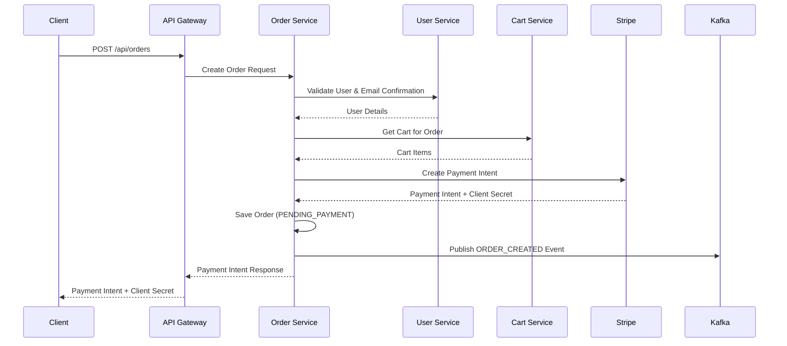
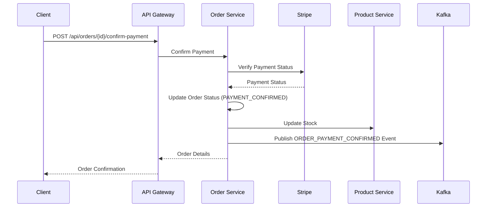

# Stripe Payment Integration Guide

This document explains the Stripe payment integration implemented in the e-commerce microservices architecture.

## Overview

The payment system is integrated into the Order Service and provides secure payment processing using Stripe. The system ensures that:

1. **Email Confirmation Required**: Users must confirm their email before placing orders
2. **Payment Required**: Orders cannot be created without successful payment
3. **Secure Processing**: All payments are processed securely through Stripe
4. **Event-Driven**: Payment events are published to Kafka for other services

## Payment Flow

### 1. Order Creation with Payment Intent



### 2. Payment Confirmation



## API Endpoints

### Create Order with Payment Intent

**POST** `/api/orders`

**Headers:**
- `Authorization: Bearer <jwt-token>`
- `X-User-Id: <user-id>`

**Request Body:**
```json
{
  "address": "123 Main St, City, State 12345",
  "phoneNumber": "+1234567890"
}
```

**Response:**
```json
{
  "clientSecret": "pi_xxx_secret_xxx",
  "paymentIntentId": "pi_xxx",
  "orderId": 123,
  "status": "requires_payment_method"
}
```

### Confirm Payment

**POST** `/api/orders/{orderId}/confirm-payment`

**Headers:**
- `Authorization: Bearer <jwt-token>`
- `X-User-Id: <user-id>`

**Response:**
```json
{
  "id": 123,
  "userId": 456,
  "address": "123 Main St, City, State 12345",
  "phoneNumber": "+1234567890",
  "status": "PAYMENT_CONFIRMED",
  "totalAmount": 99.99,
  "stripePaymentIntentId": "pi_xxx",
  "items": [...],
  "createdAt": "2024-01-01T10:00:00",
  "updatedAt": "2024-01-01T10:05:00"
}
```

## Frontend Integration

### 1. Create Order and Get Payment Intent

```javascript
const createOrder = async (orderData) => {
  const response = await fetch('/api/orders', {
    method: 'POST',
    headers: {
      'Content-Type': 'application/json',
      'Authorization': `Bearer ${token}`,
      'X-User-Id': userId
    },
    body: JSON.stringify(orderData)
  });
  
  const paymentIntent = await response.json();
  return paymentIntent;
};
```

### 2. Process Payment with Stripe Elements

```javascript
import { loadStripe } from '@stripe/stripe-js';
import { Elements, CardElement, useStripe, useElements } from '@stripe/react-stripe-js';

const stripePromise = loadStripe('pk_test_...');

const PaymentForm = ({ orderId, clientSecret }) => {
  const stripe = useStripe();
  const elements = useElements();

  const handleSubmit = async (event) => {
    event.preventDefault();

    if (!stripe || !elements) {
      return;
    }

    const cardElement = elements.getElement(CardElement);

    const { error, paymentIntent } = await stripe.confirmCardPayment(clientSecret, {
      payment_method: {
        card: cardElement,
        billing_details: {
          name: 'Customer Name',
        },
      }
    });

    if (error) {
      console.error('Payment failed:', error);
    } else if (paymentIntent.status === 'succeeded') {
      // Confirm payment on backend
      await confirmPayment(orderId);
    }
  };

  return (
    <form onSubmit={handleSubmit}>
      <CardElement />
      <button type="submit" disabled={!stripe}>
        Pay Now
      </button>
    </form>
  );
};
```

### 3. Confirm Payment on Backend

```javascript
const confirmPayment = async (orderId) => {
  const response = await fetch(`/api/orders/${orderId}/confirm-payment`, {
    method: 'POST',
    headers: {
      'Authorization': `Bearer ${token}`,
      'X-User-Id': userId
    }
  });
  
  const order = await response.json();
  console.log('Order confirmed:', order);
};
```

## Configuration

### Environment Variables

```bash
# Stripe Configuration
STRIPE_SECRET_KEY=sk_test_51234567890abcdef
STRIPE_PUBLIC_KEY=pk_test_51234567890abcdef
STRIPE_WEBHOOK_SECRET=whsec_1234567890abcdef
```

### Docker Compose

```yaml
order-service:
  environment:
    - STRIPE_SECRET_KEY=${STRIPE_SECRET_KEY}
    - STRIPE_PUBLIC_KEY=${STRIPE_PUBLIC_KEY}
    - STRIPE_WEBHOOK_SECRET=${STRIPE_WEBHOOK_SECRET}
```

## Security Features

### 1. Email Confirmation Validation

```java
// Validate user email confirmation before order creation
UserDTO user = userServiceClient.getUserById(request.getUserId());
if (!user.isEmailConfirmed()) {
    throw new EmailNotConfirmedException("User email must be confirmed before placing an order");
}
```

### 2. Payment Verification

```java
// Verify payment with Stripe before confirming order
boolean paymentConfirmed = stripePaymentService.confirmPayment(order.getStripePaymentIntentId());
if (!paymentConfirmed) {
    throw new PaymentFailedException("Payment confirmation failed for order: " + orderId);
}
```

### 3. JWT Authentication

All order endpoints require valid JWT tokens and user ID headers for authentication.

## Error Handling

### Common Error Responses

#### Email Not Confirmed
```json
{
  "error": "User email must be confirmed before placing an order"
}
```

#### Empty Cart
```json
{
  "error": "Cannot create an order with an empty cart"
}
```

#### Payment Failed
```json
{
  "error": "Payment confirmation failed for order: 123"
}
```

#### Order Not Found
```json
{
  "error": "Order not found with id: 123"
}
```

## Event Publishing

### Order Events

The system publishes the following events to Kafka:

1. **ORDER_CREATED**: When an order is created with payment intent
2. **ORDER_PAYMENT_CONFIRMED**: When payment is successfully confirmed
3. **ORDER_STATUS_UPDATED**: When order status changes

### Event Structure

```json
{
  "eventType": "ORDER_PAYMENT_CONFIRMED",
  "orderId": 123,
  "userId": 456,
  "status": "PAYMENT_CONFIRMED",
  "totalAmount": 99.99,
  "stripePaymentIntentId": "pi_xxx",
  "items": [...],
  "timestamp": "2024-01-01T10:05:00"
}
```

## Testing

### 1. Test Card Numbers

Use Stripe's test card numbers for testing:

- **Successful Payment**: `4242424242424242`
- **Declined Payment**: `4000000000000002`
- **Requires Authentication**: `4000002500003155`

### 2. Test API Calls

```bash
# Create order
curl -X POST http://localhost:8080/api/orders \
  -H "Content-Type: application/json" \
  -H "Authorization: Bearer <jwt-token>" \
  -H "X-User-Id: 1" \
  -d '{
    "address": "123 Test St, Test City, TC 12345",
    "phoneNumber": "+1234567890"
  }'

# Confirm payment
curl -X POST http://localhost:8080/api/orders/1/confirm-payment \
  -H "Authorization: Bearer <jwt-token>" \
  -H "X-User-Id: 1"
```

## Monitoring

### Payment Metrics

The system tracks the following metrics:

- Order creation rate
- Payment success rate
- Payment failure rate
- Average payment processing time
- Order status distribution

### Logging

All payment operations are logged with appropriate log levels:

- **INFO**: Successful operations
- **WARN**: Payment failures
- **ERROR**: System errors

## Production Considerations

### 1. Webhook Handling

Implement Stripe webhooks for production to handle:
- Payment confirmations
- Payment failures
- Refunds
- Disputes

### 2. Idempotency

Ensure payment operations are idempotent to prevent duplicate charges.

### 3. Rate Limiting

Implement rate limiting on payment endpoints to prevent abuse.

### 4. Monitoring

Set up alerts for:
- High payment failure rates
- Unusual payment patterns
- System errors

## Troubleshooting

### Common Issues

1. **Payment Intent Creation Fails**
   - Check Stripe API key configuration
   - Verify network connectivity
   - Check Stripe account status

2. **Payment Confirmation Fails**
   - Verify payment intent ID
   - Check payment status in Stripe dashboard
   - Ensure payment was actually successful

3. **Email Confirmation Error**
   - Verify user email is confirmed
   - Check user service connectivity
   - Verify JWT token validity

### Debug Commands

```bash
# Check order service logs
docker-compose logs order-service

# Check Stripe payment status
curl https://api.stripe.com/v1/payment_intents/pi_xxx \
  -u sk_test_xxx:

# Verify user email confirmation
curl http://localhost:8081/api/auth/user/1 \
  -H "Authorization: Bearer <jwt-token>"
```

This payment integration provides a secure, scalable, and event-driven payment processing system that ensures orders are only created after successful payment and email confirmation.
